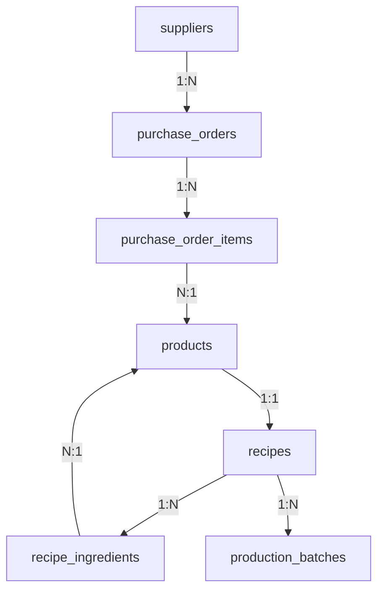

# 📦 Migrações do Sistema de Pedidos e Produção - IGEMSTOCK

## 🎯 Objetivo

Este conjunto de migrações adiciona ao sistema IGEMSTOCK as funcionalidades completas de:

- **Cadastro de Fornecedores**
- **Pedidos de Compra** 
- **Sistema de Receitas de Produção**
- **Controle de Lotes de Produção**

## 📁 Estrutura das Migrações

```
prisma/migrations/
├── 20250726185425_add_inventory_system/    # Migração original (existente)
├── 20250726190000_add_suppliers/           # ✅ Nova: Fornecedores
├── 20250726191000_add_purchase_orders/     # ✅ Nova: Pedidos de Compra  
├── 20250726192000_add_recipes_system/      # ✅ Nova: Sistema de Receitas
├── 20250726193000_add_production_system/   # ✅ Nova: Sistema de Produção
└── README_NEW_MIGRATIONS.md               # 📚 Documentação detalhada
```

## 🚀 Como Aplicar

### Opção 1: Script Automatizado (Recomendado)
```bash
cd BE-IGEMSTOCK
./scripts/apply_new_migrations.sh
```

### Opção 2: Aplicação Manual
```bash
cd BE-IGEMSTOCK

# 1. Fornecedores
npx prisma db execute --file ./prisma/migrations/20250726190000_add_suppliers/migration.sql

# 2. Pedidos de Compra  
npx prisma db execute --file ./prisma/migrations/20250726191000_add_purchase_orders/migration.sql

# 3. Sistema de Receitas
npx prisma db execute --file ./prisma/migrations/20250726192000_add_recipes_system/migration.sql

# 4. Sistema de Produção
npx prisma db execute --file ./prisma/migrations/20250726193000_add_production_system/migration.sql

# 5. Gerar cliente
npx prisma generate
```

## 🔄 Rollback (se necessário)

```bash
cd BE-IGEMSTOCK
./scripts/rollback_new_migrations.sh
```

## 📊 Tabelas Criadas

| Tabela | Propósito | Dependências |
|--------|-----------|--------------|
| `suppliers` | Cadastro de fornecedores | - |
| `purchase_orders` | Cabeçalho dos pedidos | `suppliers` |
| `purchase_order_items` | Itens dos pedidos | `purchase_orders`, `products` |
| `recipes` | Receitas de produção | `products` |
| `recipe_ingredients` | Ingredientes das receitas | `recipes`, `products` |
| `production_batches` | Lotes de produção | `recipes` |

## 🔗 Relacionamentos Principais



## ✨ Funcionalidades Implementadas

### 🏪 Gestão de Fornecedores
- Cadastro completo com contatos
- Relacionamento com pedidos de compra

### 📋 Pedidos de Compra
- Status: PENDING → RECEIVED → CANCELLED
- Controle de itens e quantidades
- Cálculo automático de totais
- Integração com movimentação de estoque

### 🍔 Sistema de Receitas
- Definição de ingredientes por produto
- Controle de quantidades necessárias
- Relacionamento produto final ↔ ingredientes

### 🏭 Controle de Produção
- Registro de lotes produzidos
- Rastreabilidade por receita
- Integração automática com estoque:
  - **OUT**: Subtração de ingredientes
  - **IN**: Adição do produto final

## 🛡️ Vantagens da Divisão

✅ **Versionamento Granular**: Cada funcionalidade tem sua própria migração  
✅ **Rollback Seletivo**: Possível reverter funcionalidades específicas  
✅ **Manutenção Facilitada**: Alterações futuras mais organizadas  
✅ **Deploy Flexível**: Aplicação opcional por ambiente  
✅ **Debug Simplificado**: Isolamento de problemas por funcionalidade  

## 📝 Próximos Passos

1. ✅ Aplicar as migrações
2. 🔧 Atualizar DTOs e serviços
3. 🎨 Criar controllers e rotas
4. 🧪 Implementar testes
5. 📱 Integrar ao frontend

---

**Criado por**: Sistema IGEMSTOCK  
**Data**: 26 de Julho de 2025  
**Versão**: 1.0.0
